<h1 align="center" style="color:#00ffcc;">
  x5368x — Linux Enthusiast | Hyprland Aesthetic
</h1>

<div align="center">


</div>

---

## ◈ Acerca de Mí

<div align="center">
  
</div>

Apasionado del ecosistema Linux y la personalización visual de entornos minimalistas. Me especializo en:

- Personalización avanzada de entornos *Wayland* (Hyprland)
- Shell scripting con *ZSH* / *Bash*
- Gestión y optimización de dotfiles
- Automatización en terminales modernas (WezTerm, Alacritty)
- Edición de configuración con *Neovim* y plugins *Lua*

> *"Cada línea de configuración es una obra visual."*

---

## ◈ Tech Stack

```yaml
OS:           Arch Linux (Rolling Release)
WM:           Hyprland (Wayland)
Shell:        Zsh + Oh-My-Zsh + Powerlevel10k
Terminal:     WezTerm GPU Accelerated
Editor:       Neovim (LazyVim + Lua Plugins)
Dotfiles:     Git-tracked & Modular
```

---

## ◈ Matriz Técnica

```mermaid
%%{init: {'theme':'base', 'themeVariables': {'pie1':'#2B2D42','pie2':'#4A4E69','pie3':'#8D99AE'}}}%%
pie showData
    title "Distribución del enfoque"
    "Arquitectura del sistema" : 45
    "Personalización de WM" : 35
    "Herramientas CLI" : 20
```

<div style="display: grid; grid-template-columns: repeat(auto-fit, minmax(300px, 1fr)); gap: 30px; margin: 40px 0;">



---

## ◈ Proyecto Actual: HyprZent-v2  

<div align="center">
  
  <h3>Configuración Personal de Hyprland</h3>
  
  
  

  **Estado Actual:**
  ```diff
  ! Proyecto en fase temprana de desarrollo
  - Versión inicial no publicada aún
  + Trabajando en configuración base
  + Experimentando con waybar
  + Creando scripts personalizados
  ```

  <div align="center">
  <a href="https://github.com/x5368x/HyprZent-v2">
    
  </a>
</div>

---

## ◈ Mis Estadísticas GitHub

<div align="center">
  
  
</div>

---

## ◈ Contacto  

<div align="center">
  <a href="https://github.com/x5368x"></a>
  <a href="https://discord.gg/NdtChxcaU8"></a>
  <a href="https://youtube.com/@xzn-q7n9q"></a>
  <a href="https://www.tiktok.com/@x_536.8"></a>
</div>

---

## ◈ Mi Enfoque  

1. **Aprendizaje práctico**: Experimentar > Teorizar
2. **Documentación**: Registrar cada solución encontrada
3. **Minimalismo**: Configuraciones limpias y funcionales
4. **Comunidad**: Aprender de y compartir con otros
5. **Paciencia**: Dominio gradual de herramientas

> *"En el mundo Linux, cada día es una nueva aventura de aprendizaje"*

<div align="center">
  
</div>